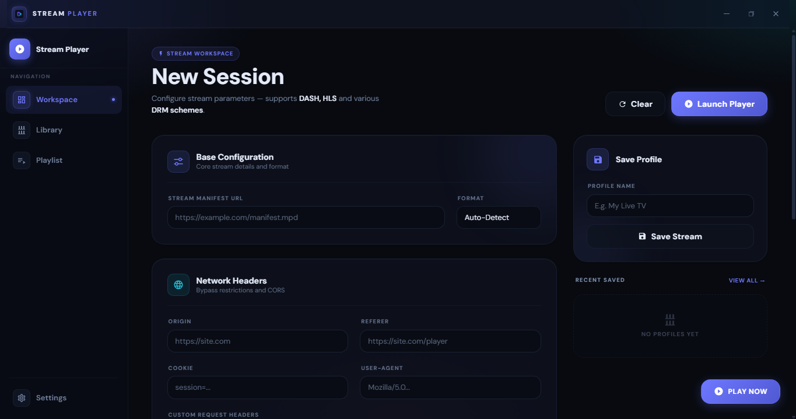
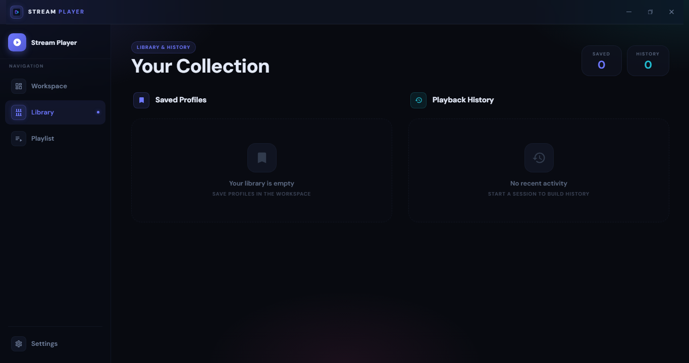
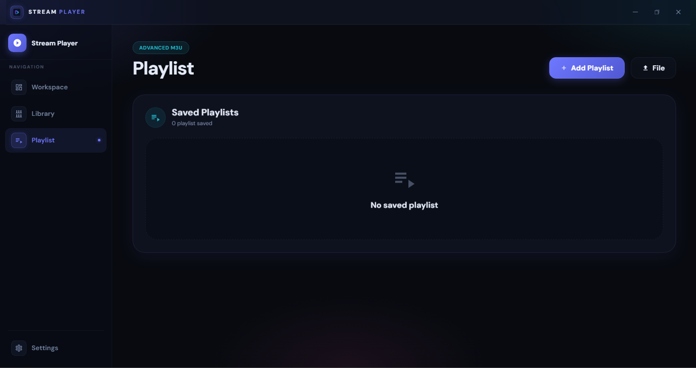
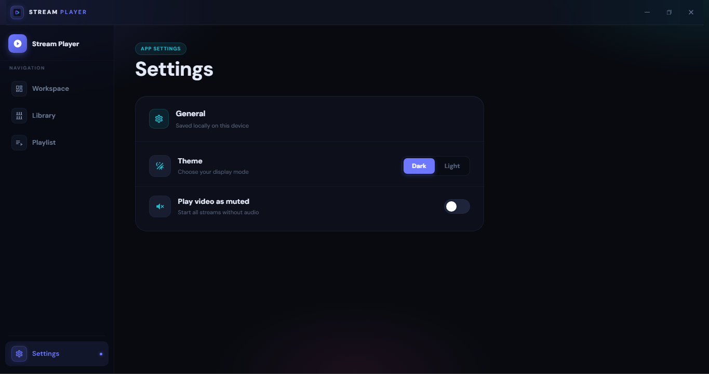
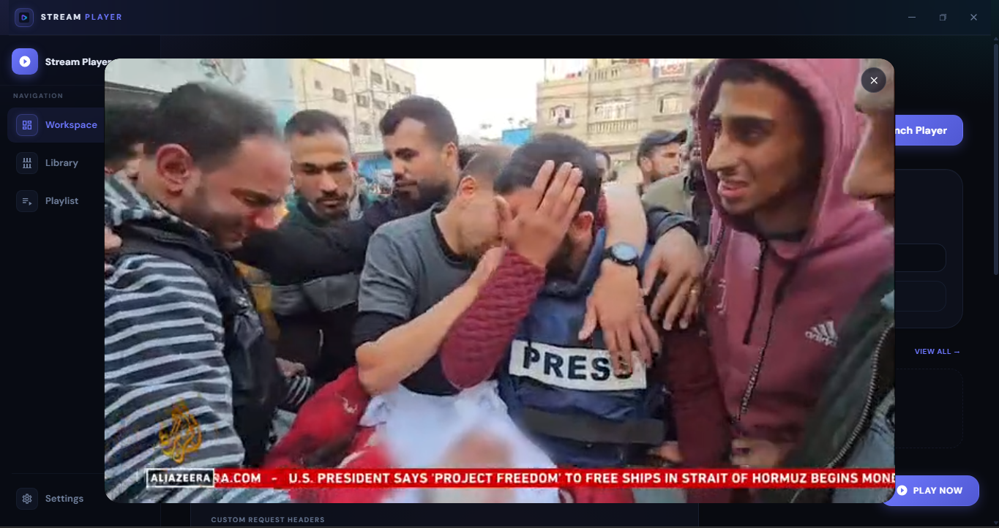

## Credits

This project is a modified and improved version of MirazMac's **Media-Stream-Player** project.

Original project: https://github.com/MirazMac/Media-Stream-Player

# Stream Player

`Stream Player` is a modern Windows desktop stream player focused on IPTV, HLS, DASH, advanced stream headers, playlist handling, and DRM-ready playback configuration.

## Screenshots

<table>
  <tr>
    <td></td>
    <td></td>
    <td></td>
    <td></td>
    <td></td>
  </tr>
</table>

## Features

### Modern Stream Workspace

- Clean stream setup workspace for quickly opening live streams and manifests.
- Supports direct stream/manifest URL input.
- Auto-detects common stream formats from URL.
- Manual stream format selection for:
  - Auto-Detect
  - HLS
  - DASH
- Built-in validation for stream URL and advanced player configuration.
- Floating **Play Now** action for faster playback.
- Recent saved stream shortcuts directly from the workspace.

### HLS and DASH Playback

- Supports HLS playlists such as `.m3u8`.
- Supports DASH manifests such as `.mpd`.
- Uses Shaka Player for adaptive streaming playback.
- Includes custom Shaka networking integration for desktop/Tauri requests.
- Supports stream type override when auto-detection is not enough.

### Advanced Network Header Support

- Supports custom request headers for stream playback.
- Dedicated fields for:
  - Origin
  - Referer
  - Cookie
  - User-Agent
- Supports extra custom headers using `Header: Value` format.
- Supports automatic header filling from pasted cURL commands.
- Supports NS Player style URL parameter parsing with headers and DRM values.
- Uses desktop HTTP fetching to help with streams that need special headers.

### DRM Configuration

- DRM option selector included in the stream workspace.
- Supports:
  - No DRM
  - ClearKey inline `kid:key`
  - ClearKey server/license URL
  - Widevine license server setup
  - PlayReady license server setup
- Supports license server URL.
- Supports license request headers.
- Supports certificate URL.
- Supports certificate headers.
- Supports advanced Shaka Player JSON/JSON5 overrides.

### Advanced M3U Playlist Support

- Add and save remote M3U playlist URLs.
- Load local `.m3u`, `.m3u8`, and `.txt` playlist files.
- Parse playlist channels into a clean channel grid.
- Supports channel name, logo, group, and TVG ID from `#EXTINF` attributes.
- Supports group filtering from `group-title` and `#EXTGRP`.
- Supports channel search by name, group, and TVG ID.
- Reload saved remote playlists.
- Opens playlist channels directly in the built-in player modal.

### M3U Header Parsing

- Supports Kodi/VLC style playlist header metadata.
- Supports `#EXTVLCOPT` headers, including referrer/referer style options.
- Supports `#EXTHTTP` header blocks.
- Supports pipe headers after URL, for example URL plus `|User-Agent=...&Referer=...` style metadata.
- Supports common header aliases:
  - `Referer`
  - `Referrer`
  - `Origin`
  - `User-Agent`
  - `Cookie`
- Unknown custom headers are preserved as request headers.

### Kodi-Style DRM in M3U

- Supports Kodi-style `#KODIPROP` metadata.
- Parses ClearKey license type from playlist items.
- Parses inline ClearKey values using `keyId:key` format.
- Parses license URL values when a server-based license is used.
- Supports playlist-level stream type hints such as DASH/MPD and HLS/M3U8.
- Supports license header metadata for DRM requests.

### Library and History

- Save stream profiles for later playback.
- Stores saved stream profiles locally.
- Keeps recent playback history.
- Prevents duplicate history entries by stream configuration signature.
- View saved profiles and recent history from the Library page.
- Replay saved streams or history items quickly.
- Delete saved profiles.
- Clear playback history.

### Playlist Library

- Saves playlist name and playlist URL locally.
- Shows saved playlist cards with playlist source URL.
- Delete saved playlists.
- Load temporary file-based playlists without permanently saving them.
- Separates remote saved playlists and file playlists.

### Player Experience

- Rounded player modal design.
- Close button stays outside the video area in a separate player bar.
- Dynamic player sizing based on detected video dimensions.
- Fullscreen-friendly player layout.
- Error display inside the player with readable Shaka error information.
- Saves and restores player volume.
- Optional muted playback setting.
- Includes a custom live button integration for Shaka UI.

### Settings

- Light and dark theme support.
- Improved softer dark mode design.
- Light mode design support.
- Player muted-by-default preference.
- Settings are stored locally.

### UI and Design

- Modern glass-style card layout.
- Sidebar-style app navigation.
- Responsive layout for different screen sizes.
- Clean channel cards with logo, title, and group metadata.
- Toast notifications for actions and errors.
- Dedicated empty states for saved streams, playlists, history, and search results.
- Smooth visual transitions and rounded interface elements.

## Supported Playlist Metadata Examples

```m3u
#EXTINF:-1 tvg-name="Demo Channel" tvg-logo="https://example.com/logo.png" group-title="Sports",Demo Channel
#EXTVLCOPT:http-referrer=https://example.com/
#EXTVLCOPT:http-user-agent=Mozilla/5.0
#KODIPROP:inputstream.adaptive.license_type=clearkey
#KODIPROP:inputstream.adaptive.license_key=11223344556677889900112233445566:4b80724d0ef86bcb2c21f7999d67739d
https://example.com/manifest.mpd
```

## Main Feature Summary

Stream Player PC includes IPTV playlist management, HLS/DASH playback, custom HTTP headers, Kodi-style ClearKey playlist parsing, saved stream profiles, playback history, theme settings, and a modern rounded desktop player interface.
